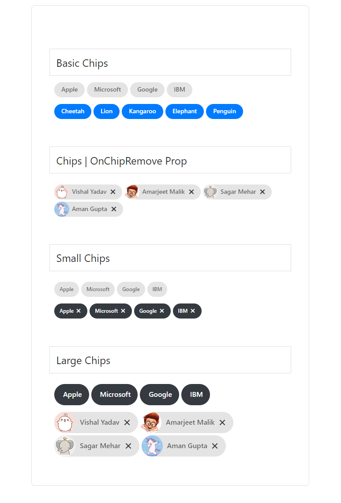

# vue-material-chips
Vue.js plugin made for chips using material theme

## [JSFiddle](https://jsfiddle.net/nemeton_x/axrcpu1z/)

## Installation
```bash
# npm
npm install --save vue-material-chips 
```
## Examples


## Usage
```js
<template>
  <div>
    <VueMaterialChips :chip-data="['Apple', 'Microsoft', 'Google', 'IBM']"></VueMaterialChips>
  </div>
</template>
<script>
import VueMaterialChips from 'vue-material-chips';

export default {
  components: [VueMaterialChips]
}

</script>
```

## Available options
The API methods accepts these options:

| Attribute        | Type                | Default              | Description      |
| :---             | :---:               | :---:                | :---             |
| chipData         | Array               | --                   |  a required field, accepts array, if you would like to pass chipData with imageUrl pass it this way eg. [{ imgUrl: "", value: "" }]   |
| chipType         | String              | normal               |  Accepts 3 values `small`, `normal`, `large`   |
| cssClass         | String              | --                   |  You can pass a custom css class to chips with this prop  |
| onChipRemove     | Function            | --                   |  If passed, chips will have a cancel button and onChipRemove will get invoked with chip record  |
        

## Credits
* MaterializeCSS [Chips](https://materializecss.com/chips.html)
